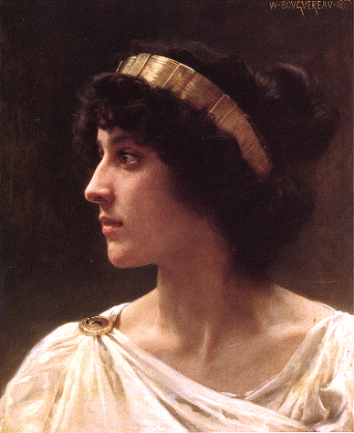

# BiblioSappho ⚢
BiblioSappho é meu projeto final para o curso intensivo em tecnologia da [{reprograma}](https://reprograma.com.br), turma de back-end On19. Se trata de uma API com funções CRUD  organizada em um modelo de biblioteca na qual é possível cadastrar usuárias e mídias, com foco em representatividade sáfica (amor entre mulheres). O nome foi pensado por mim combinando o termo "biblio", de origem do grego ***biblion*** "papel ou rolo com escrita" e o nome da língua inglesa da poeta grega Safo de Lesbos. Safo é uma das mais proeminentes figuras femininas da literatura antiga, e é devido à sua relevância em escrever obras de teor romântico à outras mulheres que usamos os termos "lésbica" (gentílico para a ilha de Lesbos) e "sáfica" (acredito eu que esse termo torne desnecessário justificativa).
 

## justificativa
Mulheres de atração homoafetiva, assim como outros grupos minoritários, são alvos de diversos preconceitos e falta de representatividade. Estudos por organizações como a Gestão Kairós e o Núcleo de Inclusão Social da UFRJ apresentam que [mulheres lésbicas e bissexuais compõem menos de 3% do quadro geral de empresas](https://www.terra.com.br/nos/dia-da-visibilidade-lesbica-onde-elas-estao-no-mercado-de-trabalho,7ef155221572a5e688ecf334a5982e67z3g63j2p.html) e [que houve um crescimento de 150% no número de assassinatos de mulheres lésbicas em apenas 4 anos, de 2014 a 2017](https://dossies.agenciapatriciagalvao.org.br/fontes-e-pesquisas/wp-content/uploads/sites/3/2018/04/Dossi%C3%AA-sobre-lesboc%C3%ADdio-no-Brasil.pdf) (ocorrendo o maior número de casos com mulheres não-feminilizadas, ou seja que não se conformam à uma apresentação de gênero feminina). 

Sabendo da importância de representar grupos minotários, inclusive em mídias, esse projeto permite expandir a visibilidade de mulheres que amam mulheres, com o cadastro de obras que demonstrem tais afetos.

## rotas e retornos

As possíveis requisições, seus métodos e funções são:

|Método|Rota|Retorno|
|-|-|-|
|GET|BiblioSappho|indíce e rota raíz|
|POST|/users/register|registra nova usuária no sistema|
|POST|/works/new|cadastra nova obra|
|POST|/users/login|realiza o login de uma usuária, retornando o token de tal acesso|
|GET|/users/all|lista todas usuárias cadastradas|
|GET|/users/:id|apresenta perfil de uma única usuária por seu id|
|GET|/works/all|lista todas obras cadastradas|
|GET|/works/:id|visualiza obra por ID|
|GET|/works/genre/:genre|pesquisa obras por gênero|
|GET|/works/medium/:medium|pesquisa obras por formato de mídia (livros, jogos, filmes, etc)|
|PATCH|/users/update/:id|atualiza informações de uma usuária*|
|PATCH|/works/update/:id|atualiza comentários/resenha de uma obra*|
|PATCH|/works/favorite|altera parâmetro de favorito em uma obra para verdadeiro ou falso, correspondentemente adicionando ou removendo da lista de favoritos da usuária*|
|DELETE|/users/delete/:id|apaga o perfil cadastrado de uma usuária*|
|DELETE|/works/remove/:id|remove uma obra cadastrada*|

<h6>
*Rotas nas quais é necessária autenticação, com token de acesso.

Documentação da API também está disponível [online](https://bibliosappho.onrender.com/documentation-route/).
</h6>

## 🏳️‍🌈 autora

Desenvolvido por uma mulher trans lésbica, com apoio de toda a equipe da {reprograma} e turma On19.

<h1 align="center">
  
</h1>

<h6 align="center"> 
Fotografia da autora nas escadas do Musem de Imagem e Som de Curitiba.
 </h6>

[LinkedIn](https://www.linkedin.com/in/rocha-laura/)